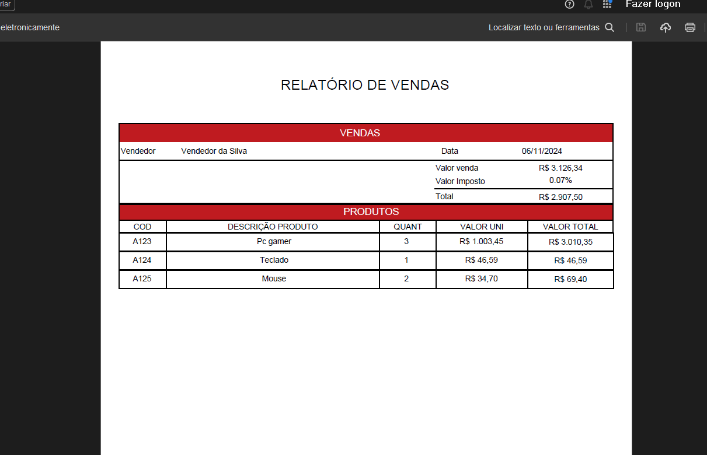

# Gerador de Relatório 
Projeto consiste em gerar um relatório de venda que possue um subrelatorio com produtos, gerando um arquivo em PDF 

 # Tecnologias e ferramentas usadas
 * Spring boot - Framework utilizada com a arquitetura MVC.
 * Lombok - para Gerar os construtores e os métodos Getter e Setter no projeto..
 * Spring-boot-devtools - Pela facilidade no reload ao realizar uma modificação.
 * Java 17 - usado no código fonte.
 * JasperReports 6.20.6
 * itext 2.1.7.

# Executando o projeto

## Existe duas formas de execultar o projeto: 
* Com o código fonte, neste é necessário executar o arquivo "RelatorioApplication.java", como "Java application" ou executando o comando mvn spring-boot:run

 Após a execução do projeto, pode ser acessado na url http://localhost:8080/api/relatorio/vendas

# Modelo do Relatório 

### Home parte 1

  

